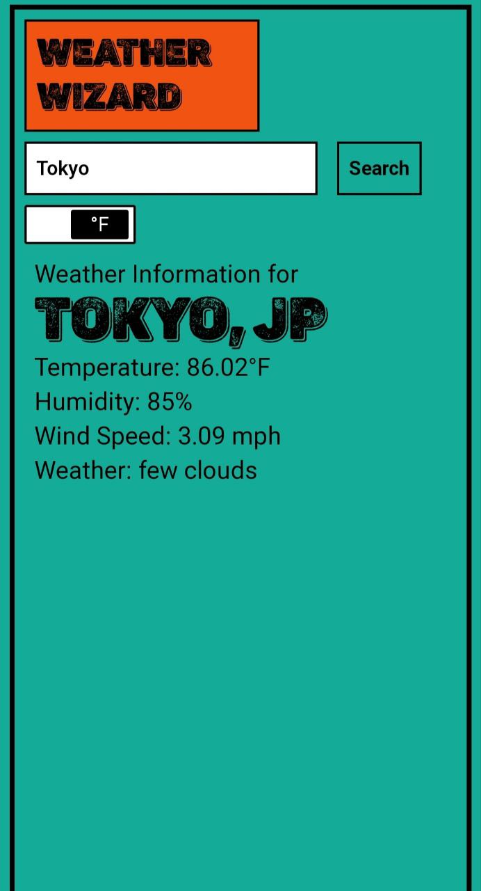

# Weather App

The Weather Wizard is a simple web application that allows users to check the current weather conditions for a specific location. It provides real-time weather data, including temperature, humidity, wind speed, and weather description. Users can also toggle between Celsius and Fahrenheit temperature units.

## 🚀 Demo
Check out the live demo [here](https://weatherwizards.vercel.app/) .

## Features

- Check the current weather conditions for any city or location.
- Toggle between Celsius and Fahrenheit temperature units.
- User-friendly and responsive interface.

## 💻 Technologies Used

- React.js
- Axios (for making API requests)
- HTML5 Geolocation API (for detecting user's location)
- OpenWeatherMap API (for weather data)
- Tailwind CSS (for styling)

## 📷 Screenshots

